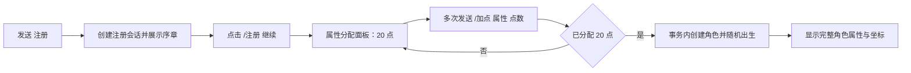

# QQ 文字 RPG（异世界）实施方案

## 1. 目标与边界

本方案在当前 AlemonJS + QQ 机器人模板上实现一个可持续扩展的文字 RPG：玩家向 QQ 机器人发送文字命令或点击按钮，机器人返回文字、Markdown 与快捷按钮；全部长期数据保存到 MySQL 8。

首个可交付版本（MVP）只完成“注册—剧情—分配属性—出生—查看角色/地图”闭环。战斗、背包、任务和经济系统应在该闭环稳定后逐步加入，避免一开始把所有玩法耦合在注册逻辑中。

### MVP 玩家流程



按钮的 `data` 统一放可直接发送的命令，例如 `/注册 继续`、`/角色`、`/地图`。这样 QQ 客户端不支持按钮、按钮权限不足或玩家手动输入时，仍可完成全部流程。

## 2. 技术选型

| 范畴 | 选择 | 原因 |
| --- | --- | --- |
| 框架与 QQ 适配 | 现有 `alemonjs`、`@alemonjs/qq-bot` | 与当前项目一致，支持消息和交互事件。 |
| 数据库 | MySQL 8.0（`utf8mb4`） | 事务、索引、空间范围查询和运维资料成熟。 |
| Node 数据库驱动 | `mysql2` | Promise API、连接池、预处理参数，适合 TypeScript。 |
| ID | 数据表用 `BIGINT UNSIGNED`；业务 UUID 用 `CHAR(36)` | 方便关联、日志追踪和未来分库。 |
| 随机数 | 应用层随机坐标，数据库最终校验 | 容易保证出生点确实属于区域。 |

不保存 QQ `secret` 到 Git；只在未提交的 `alemon.config.yaml` 中配置。生产环境另为 MySQL 创建权限最小的独立账号。

## 3. 建议目录与职责

在 `src/` 下增量增加以下模块，保留现有入口和 Router 写法：

```text
src/
  index.ts                         # 注册路由（注册、加点、角色、地图）
  response/
    game-register.ts               # 注册和剧情继续
    game-allocate.ts               # 加点、重置、确认
    character.ts                    # /角色
    map.ts                          # /地图
  game/
    constants.ts                    # 六维属性、初始点、公式常量
    character.service.ts            # 角色创建、派生属性计算
    allocation.service.ts           # 会话加点及最终确认
    map.service.ts                  # 出生区域与坐标生成
    message.ts                      # Format、Markdown、按钮构建
    types.ts                        # 领域类型，不暴露数据库行对象
  database/
    pool.ts                         # mysql2 连接池和事务辅助函数
    migration/001_initial.sql       # 首次建表脚本
```

路由使用 `Router.create().group().use()`，handler 用 `useEvent()` / `useRoute()` 取上下文，消息通过 `Format.create()` 统一组装。不要在 handler 中直接拼 SQL；SQL 仅存在于 `service` 或 repository 层。

建议命令如下：

| 命令 | 行为 |
| --- | --- |
| `注册` | 未注册时开始序章；注册流程中显示当前步骤；已注册时提示使用 `/角色`。 |
| `/注册 继续` | 展示属性分配面板。 |
| `/加点 体质 3` | 对尚未确认的分配会话加点。六项属性均适用。 |
| `/重置加点` | 本次注册会话恢复为 20 可分配点。 |
| `/确认属性` | 仅在正好分完 20 点时创建角色。 |
| `/角色` | 展示基础、派生属性、当前位置。 |
| `/地图` | 展示当前区域、三轴坐标与可用移动入口（后续实现）。 |

## 4. 数据模型

### 4.1 设计规则

- QQ 用户 ID 是外部唯一标识：`players.qq_user_id` 唯一；不要把昵称作为身份。
- `characters` 是角色当前状态；基础六维单独列，便于加点、筛选与公式计算。
- 派生属性在角色创建、升级、装备变化时重算并落库，战斗读数稳定；公式版本号便于平衡性迭代。
- 坐标使用三个整数 `x/y/z`，范围由 `map_regions` 的 min/max 列定义。先不用 GIS 类型，普通复合索引足够。
- 货币、经验等累计字段不使用浮点数；比例使用 `DECIMAL` 或以万分比整数保存。

### 4.2 首次建表 SQL

新建文件 `src/database/migration/001_initial.sql`，内容如下。所有表均为 `utf8mb4`，因此可安全存中文地名和剧情。

```sql
CREATE DATABASE IF NOT EXISTS fantasy_final
  CHARACTER SET utf8mb4 COLLATE utf8mb4_unicode_ci;
CREATE USER IF NOT EXISTS 'fantasy_app'@'%' IDENTIFIED BY '请替换为长随机密码';
GRANT SELECT, INSERT, UPDATE, DELETE, CREATE, ALTER, INDEX
  ON fantasy_final.* TO 'fantasy_app'@'%';
FLUSH PRIVILEGES;
USE fantasy_final;

CREATE TABLE players (
  id BIGINT UNSIGNED NOT NULL AUTO_INCREMENT,
  qq_user_id VARCHAR(32) NOT NULL,
  qq_nickname VARCHAR(128) NULL,
  status ENUM('registering','active','banned') NOT NULL DEFAULT 'registering',
  created_at DATETIME NOT NULL DEFAULT CURRENT_TIMESTAMP,
  updated_at DATETIME NOT NULL DEFAULT CURRENT_TIMESTAMP ON UPDATE CURRENT_TIMESTAMP,
  PRIMARY KEY (id), UNIQUE KEY uk_players_qq_user_id (qq_user_id)
) ENGINE=InnoDB;

CREATE TABLE registration_sessions (
  id CHAR(36) NOT NULL,
  player_id BIGINT UNSIGNED NOT NULL,
  stage ENUM('story','allocate') NOT NULL DEFAULT 'story',
  constitution SMALLINT UNSIGNED NOT NULL DEFAULT 0,
  spirit SMALLINT UNSIGNED NOT NULL DEFAULT 0,
  strength SMALLINT UNSIGNED NOT NULL DEFAULT 0,
  intelligence SMALLINT UNSIGNED NOT NULL DEFAULT 0,
  agility SMALLINT UNSIGNED NOT NULL DEFAULT 0,
  perception SMALLINT UNSIGNED NOT NULL DEFAULT 0,
  expires_at DATETIME NOT NULL,
  created_at DATETIME NOT NULL DEFAULT CURRENT_TIMESTAMP,
  PRIMARY KEY (id), UNIQUE KEY uk_registration_player (player_id),
  CONSTRAINT fk_registration_player FOREIGN KEY (player_id) REFERENCES players(id) ON DELETE CASCADE
) ENGINE=InnoDB;

CREATE TABLE map_regions (
  id BIGINT UNSIGNED NOT NULL AUTO_INCREMENT,
  code VARCHAR(64) NOT NULL,
  name VARCHAR(64) NOT NULL,
  description TEXT NOT NULL,
  min_x INT NOT NULL, max_x INT NOT NULL,
  min_y INT NOT NULL, max_y INT NOT NULL,
  min_z INT NOT NULL, max_z INT NOT NULL,
  is_spawn_enabled TINYINT(1) NOT NULL DEFAULT 0,
  danger_level SMALLINT UNSIGNED NOT NULL DEFAULT 1,
  PRIMARY KEY (id), UNIQUE KEY uk_regions_code (code),
  CONSTRAINT ck_region_x CHECK (min_x <= max_x),
  CONSTRAINT ck_region_y CHECK (min_y <= max_y),
  CONSTRAINT ck_region_z CHECK (min_z <= max_z)
) ENGINE=InnoDB;

CREATE TABLE characters (
  id BIGINT UNSIGNED NOT NULL AUTO_INCREMENT,
  player_id BIGINT UNSIGNED NOT NULL,
  name VARCHAR(24) NOT NULL,
  level INT UNSIGNED NOT NULL DEFAULT 1,
  experience BIGINT UNSIGNED NOT NULL DEFAULT 0,
  constitution SMALLINT UNSIGNED NOT NULL,
  spirit SMALLINT UNSIGNED NOT NULL,
  strength SMALLINT UNSIGNED NOT NULL,
  intelligence SMALLINT UNSIGNED NOT NULL,
  agility SMALLINT UNSIGNED NOT NULL,
  perception SMALLINT UNSIGNED NOT NULL,
  hp_max INT UNSIGNED NOT NULL, mp_max INT UNSIGNED NOT NULL,
  physical_attack INT UNSIGNED NOT NULL, magic_attack INT UNSIGNED NOT NULL,
  physical_defense INT UNSIGNED NOT NULL, magic_defense INT UNSIGNED NOT NULL,
  accuracy INT UNSIGNED NOT NULL, evasion INT UNSIGNED NOT NULL,
  crit_rate_bp INT UNSIGNED NOT NULL, crit_damage_bp INT UNSIGNED NOT NULL,
  crit_resist_bp INT UNSIGNED NOT NULL, crit_damage_reduction_bp INT UNSIGNED NOT NULL,
  tenacity INT UNSIGNED NOT NULL, speed INT UNSIGNED NOT NULL,
  stat_formula_version SMALLINT UNSIGNED NOT NULL DEFAULT 1,
  current_region_id BIGINT UNSIGNED NOT NULL,
  pos_x INT NOT NULL, pos_y INT NOT NULL, pos_z INT NOT NULL,
  created_at DATETIME NOT NULL DEFAULT CURRENT_TIMESTAMP,
  updated_at DATETIME NOT NULL DEFAULT CURRENT_TIMESTAMP ON UPDATE CURRENT_TIMESTAMP,
  PRIMARY KEY (id), UNIQUE KEY uk_characters_player (player_id),
  KEY idx_character_position (current_region_id, pos_x, pos_y, pos_z),
  CONSTRAINT fk_character_player FOREIGN KEY (player_id) REFERENCES players(id),
  CONSTRAINT fk_character_region FOREIGN KEY (current_region_id) REFERENCES map_regions(id)
) ENGINE=InnoDB;

CREATE TABLE player_events (
  id BIGINT UNSIGNED NOT NULL AUTO_INCREMENT,
  player_id BIGINT UNSIGNED NOT NULL,
  event_type VARCHAR(64) NOT NULL,
  payload JSON NOT NULL,
  created_at DATETIME NOT NULL DEFAULT CURRENT_TIMESTAMP,
  PRIMARY KEY (id), KEY idx_player_events_player_created (player_id, created_at),
  CONSTRAINT fk_event_player FOREIGN KEY (player_id) REFERENCES players(id) ON DELETE CASCADE
) ENGINE=InnoDB;

INSERT INTO map_regions
  (code, name, description, min_x, max_x, min_y, max_y, min_z, max_z, is_spawn_enabled, danger_level)
VALUES
  ('world_tree', '世界树', '世界的中心，坐标原点。', -100, 100, -100, 100, -20, 120, 0, 0),
  ('dark_forest', '幽暗密林', '常年被薄雾笼罩的初始区域。', 300, 700, -500, -100, 0, 80, 1, 1);
```

`player_events` 是审计/玩法事件流：注册成功、加点确认、移动、获得物品等各写一条 JSON 事件。它不是角色状态的唯一来源；当前状态仍由专用表维护，查询不会变慢。

## 5. 属性与公式（v1）

初始可分配点为 20，所有属性初始为 0；每次加点必须是正整数，单项上限暂定 20。确认时六项总和必须严格等于 20。

| 属性 | 主要影响 |
| --- | --- |
| 体质 | 生命上限、物理防御、韧性 |
| 精神 | 魔力上限、魔法防御、爆免 |
| 力量 | 物理攻击、物理防御、爆伤 |
| 智力 | 魔法攻击、魔法防御、爆抗 |
| 敏捷 | 速度、闪避、少量命中 |
| 感知 | 命中、暴击、少量闪避 |

以下是易调参且可读性高的第一版公式。`bp` 是万分比：100 bp = 1%；显示时除以 100 并附 `%`。

```text
生命上限 = 100 + 体质 × 25
魔力上限 = 50 + 精神 × 20
物理攻击 = 10 + 力量 × 5
魔法攻击 = 8 + 智力 × 5
物理防御 = 5 + 体质 × 2 + 力量
魔法防御 = 3 + 精神 × 2 + 智力
命中     = 8000 + 感知 × 100 + 敏捷 × 30
闪避     = 敏捷 × 80 + 感知 × 20
暴击     = 感知 × 50
爆伤     = 15000 + 力量 × 100
爆免     = 精神 × 40
爆抗     = 智力 × 40
韧性     = 体质 × 3 + 精神 × 2
速度     = 100 + 敏捷 × 8
```

战斗阶段再明确命中、减伤、暴击抵抗的上下限；注册阶段只负责可靠地产生这些初始数值。公式应集中在 `game/constants.ts` 的纯函数，禁止散落在 SQL 或消息 handler 内。

## 6. 关键业务实现要求

### 6.1 注册和并发安全

1. 收到 `注册`，使用 `INSERT ... ON DUPLICATE KEY` 找到或创建 `players` 行；若角色已存在，直接返回角色菜单。
2. 创建/更新唯一的 `registration_sessions`，阶段为 `story`，过期时间为当前时间后 30 分钟。
3. `/注册 继续` 将该会话转到 `allocate` 并返回剩余点数和六个快捷加点按钮。
4. `/加点` 和 `/确认属性` 都必须放在同一个 MySQL 事务内，先 `SELECT ... FOR UPDATE` 锁住会话行，校验阶段、过期、点数与总和，再写回。
5. 确认时在同一事务内：锁会话 → 校验总和 20 → 选择出生区域 → 生成坐标 → 插入 `characters` → 更新玩家为 `active` → 删除会话 → 写入 `player_events`。若 QQ 重复投递或玩家连点，唯一索引 `uk_characters_player` 确保只产生一个角色。

### 6.2 出生坐标

- 世界树固定为 `(0, 0, 0)`；它是地理原点，不等同于所有区域的中心。
- 查询 `is_spawn_enabled = 1` 的区域。本期只有“幽暗密林”。
- 在该区域的三组闭区间内均匀随机整数；如未来加入禁区、障碍物或占位点，再检查 `map_tiles` / `map_blockers` 后重试，失败 20 次则记录错误并回滚。
- 创建角色时 `current_region_id` 和三轴坐标必须一起写入；移动时也必须在单个事务中校验目标点仍落在允许区域。

## 7. 环境搭建与配置教程

### 7.1 准备 QQ 机器人

1. 在 QQ 开放平台创建机器人应用，开通所需的群/私聊消息权限，并取得 `AppID` 和 `AppSecret`。
2. 开发初期使用 SDK 默认的 WebSocket 模式，不要填 `port` / `route`；Webhook 需要公网 HTTPS 地址，且切换后平台会停用 WebSocket。
3. 在项目根目录编辑 `alemon.config.yaml`（该文件必须加入 `.gitignore`），填入：

```yaml
qq-bot:
  app_id: '你的 AppID'
  secret: '你的 AppSecret'
  sandbox: true # 联调通过后改为 false
  markdownToText: true # 没有 QQ Markdown 权限时自动降级为文字
  hideUnsupported: 1

FantasyFinal:
  database:
    host: '127.0.0.1'
    port: 3306
    database: 'fantasy_final'
    user: 'fantasy_app'
    password: '与 MySQL 中一致的长随机密码'
    connectionLimit: 10
```

当前已安装的 QQ 适配器读取的键名就是 `qq-bot.app_id` 与 `qq-bot.secret`。配置里不得出现实际密钥的示例、截图或提交记录。

### 7.2 使用 Docker 启动 MySQL（推荐本地开发）

安装 Docker Desktop 后，在 PowerShell 执行。先自行替换两个密码，且不要把命令历史或配置上传到公开仓库。

```powershell
docker run --name fantasy-final-mysql -d `
  -e MYSQL_ROOT_PASSWORD='替换为Root长密码' `
  -e MYSQL_DATABASE='fantasy_final' `
  -e MYSQL_USER='fantasy_app' `
  -e MYSQL_PASSWORD='替换为应用长密码' `
  -p 127.0.0.1:3306:3306 `
  -v fantasy-final-mysql:/var/lib/mysql `
  mysql:8.4
```

等待 `docker logs fantasy-final-mysql` 显示可接受连接后，导入初始结构：

```powershell
Get-Content -Raw src\database\migration\001_initial.sql |
  docker exec -i fantasy-final-mysql mysql -uroot -p替换为Root长密码
```

注意：上面的 SQL 会创建应用账号；若容器启动时已经用 `MYSQL_USER` 创建了同名账号，`CREATE USER IF NOT EXISTS` 可以安全重复执行。

### 7.3 不用 Docker 时

安装 MySQL Community Server 8.0+，用 MySQL Shell 或任意管理客户端以 root 登录后执行 `src/database/migration/001_initial.sql`。只允许本机访问时，将 SQL 中 `'fantasy_app'@'%'` 改为 `'fantasy_app'@'localhost'`，安全性更高。

### 7.4 安装驱动、实现连接池和启动

```powershell
yarn add mysql2
yarn dev
```

连接池只在 `src/database/pool.ts` 创建一次；启动时执行一次轻量 `SELECT 1` 作为健康检查。所有查询使用 `?` 占位符，绝不把 QQ 消息文本拼进 SQL 字符串。

开发验证顺序：

1. `yarn dev` 启动机器人，确认 QQ 上 `/help` 能返回消息。
2. 在测试频道发送 `注册`，点击“继续”或输入 `/注册 继续`。
3. 使用六个 `/加点` 命令将点数准确分到 20，再输入 `/确认属性`。
4. 运行 `SELECT qq_user_id, status FROM players;` 和 `SELECT * FROM characters;`，确认只有一名玩家和一个角色，出生区域是 `dark_forest` 且坐标在定义范围内。
5. 并行快速发送两次 `/确认属性`，确认仍只产生一个角色。
6. 每次代码改动后执行 `npx tsc --noEmit`；若项目随后增加 ESLint，再将 lint 加入同一验证步骤。

## 8. 迭代里程碑

1. **基础设施**：安装 `mysql2`、连接池、迁移脚本、配置校验、健康检查。
2. **创建角色**：注册剧情、属性会话、事务确认、幽暗密林出生、`/角色`。
3. **世界探索**：区域查询、移动冷却、坐标校验、地图显示和事件日志。
4. **战斗循环**：怪物刷新、回合结算、掉落、经验和等级成长。
5. **内容系统**：装备、技能、任务、NPC、世界树传送与管理后台命令。

每个里程碑独立可玩、可回归测试；不要提前把怪物/背包字段塞进 `characters` 表。后续内容各自建关联表并通过事件日志保留操作轨迹。
