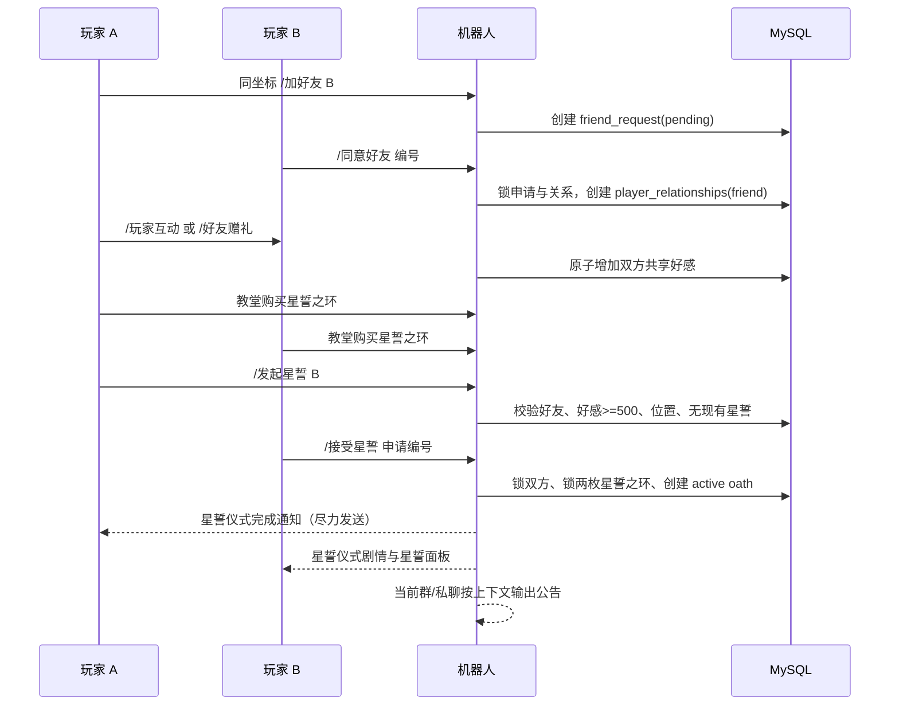

# 好感与星誓系统实施方案

> 目标：在现有《幻想次元》文字 RPG 中加入“游戏内好友—玩家好感—圣恩教堂星誓—双人星誓仪式剧情”完整闭环。
>
> 本方案是可执行的 v1 开发规格，按当前 AlemonJS + MySQL 结构增量实现。方案中的“好友”指游戏内好友关系，不调用 QQ 平台好友 API；两名玩家必须分别注册角色，并通过游戏内申请完成关系建立。

## 1. 当前结构审计与设计结论

当前项目已有以下可复用能力：

| 现有能力 | 当前实现 | 本功能复用方式 |
| --- | --- | --- |
| 玩家身份 | `players.qq_user_id`、`characters.game_id` | 所有目标操作使用游戏 ID，不把昵称当身份 |
| 同坐标发现玩家 | `adventure.service.ts` 的坐标目标查询 | “加好友”、好友互动和星誓前置位置校验 |
| 玩家互动 | `dungeon.service.ts` 的 `interactDungeonPlayer` | 扩展为好友互动并增加好感 |
| 现成按钮 | `adventure.ts` 已有 `[加好友]` | 接入 `/加好友 <游戏ID>` 路由 |
| NPC 好感 | `player_npc_affinity`、`addNpcAffinity`、阶段称号 | 只参考数值与每日限制，不与玩家好感共用表 |
| 教堂 | `response/church.ts`、`saint_church` 建筑 | 作为唯一星誓场所与祈福、剧情奖励场所；不设置商店 |
| 物品与背包 | `item_definitions`、`player_inventory`、物品图鉴 | 心意道具和星誓之环全部进入现有背包/图鉴 |
| 消息排版 | `Format`、`Format.createMarkdown()`、按钮组 | 星誓仪式剧情按章节分段，按钮均可降级为文字命令 |
| 事务 | `withTransaction` | 好感、物品、申请、星誓状态必须原子提交 |
| 事件记录 | `player_events` | 记录好友、赠礼、星誓、解除等状态变更 |

当前需要特别处理的缺口：

1. `adventure.ts` 已显示“加好友”按钮，但 `src/index.ts` 尚未注册对应命令。
2. `玩家互动` 目前只返回打招呼文本，不保存玩家关系，也不会增加好感。
3. `church.ts` 的“星誓”和“祈福”按钮尚未接入实际命令；教堂当前没有商店。
4. NPC 好感表是单个角色到 NPC 的单向关系，不能直接改成玩家对玩家关系；玩家关系必须使用一对玩家的规范化主键。
5. 不能只在 handler 中判断“对方是否在线”或“是否还在当前位置”。申请、物品消耗和最终星誓都必须再次从数据库锁行校验。

### 1.1 v1 必须遵守的决定

1. 星誓不限制性别、种族、职业或是否同队；只要求双方都是已注册玩家、互为游戏好友、好感达标并完成双方确认。
2. 好感是对称值，数据库只保存一份：`min(character_id) -> max(character_id)`。两名玩家看到的数值完全一致。
3. 申请人与接受人必须在圣恩教堂坐标完成星誓确认；申请可以先发出，但接受时必须重新验证位置。
4. 好感礼物只允许赠送配置了 `effect_json.playerAffinity` 的白名单物品，不能把任意装备、货币或普通材料当作礼物。
5. 星誓之环由双方各持一枚，星誓仪式完成时同时消耗；任何一步失败都不得只扣一方的物品。
6. 好感不自然衰减；每日互动和赠礼有上限，避免刷屏和无上限增长。
7. v1 不修改战斗基础属性。星誓的首要收益是关系状态、双人剧情、队伍标识和纪念互动；祈福提供独立的限时个人增益，不把关系系统强耦合到战斗结算。
8. 解除星誓保留好友关系与已有好感，不返还星誓之环；重新星誓必须重新走双方申请和确认流程。

## 2. 玩家关系与好感规则

### 2.1 关系阶段

关系阶段用于好友面板、星誓资格提示和文案变化。数值只有一份，阶段由服务层纯函数计算，不把阶段重复存入数据库。

| 好感 | 阶段 | 说明 |
| ---: | --- | --- |
| 0～49 | 初识 | 已成为游戏内好友，但还只是偶尔照面的同伴 |
| 50～199 | 相知 | 开始记得彼此的习惯与冒险路线 |
| 200～499 | 交心 | 可以互相赠礼，教堂会提示星誓还差多少 |
| 500～999 | 莫逆 | 达到星誓最低好感要求 |
| 1000～1999 | 同行 | 星誓后可显示特殊关系称号 |
| 2000 及以上 | 星誓共鸣 | 作为长期关系的最高展示阶段，v1 不再提供战斗数值加成 |

星誓门槛固定为：

```text
双方已接受好友关系
关系好感 >= 500
双方当前没有其他 active 星誓
双方均已注册且不是 NPC
双方均在圣恩教堂的建筑坐标
双方各持有 1 枚星誓之环
```

### 2.2 好感来源与限制

| 行为 | 好感 | 条件 | 每日限制 |
| --- | ---: | --- | ---: |
| 好友互动 | +5 | 同一坐标、双方已是好友、非战斗状态 | 每对好友 3 次 |
| 赠送心意花束 | +25 | 同一坐标、目标已是好友、每次 1 个 | 每对好友每日最多 3 次礼物 |
| 赠送共鸣果实 | +80 | 同一坐标、目标已是好友、每次 1 个 | 每对好友每日最多 1 个 |
| 星誓纪念 | +10 | 已星誓双方都在教堂 | 每对关系每日 1 次 |

祈福规则：

- 每名玩家每天只能祈福 1 次，业务日期按 `Asia/Shanghai` 计算。
- 祈福只对当前玩家生效：获得 1 小时经验获取 `+25%`，并获得全六项核心属性 `+5%` 的限时增益。
- 增益不叠加；已有增益时再次祈福只刷新为当前时间起 1 小时，不能延长到超过 1 小时。
- 当前处于 active 星誓状态的玩家，祈福时必得 `心意花束 ×1`，并以 `10%` 概率额外获得 `共鸣果实 ×1`。
- `心意花束` 和 `共鸣果实` 只能通过教堂祈福获得；教堂不出售这两件道具，也不新增教堂商店。

每日限制以 `Asia/Shanghai` 为业务日期，不能用服务器本地日期字符串直接判断。限制计数与好感更新必须处在同一事务中。

`玩家互动` 的兼容行为：

- 目标不是好友：保留现有“打了个招呼”的文本，不加好感；文案中提供“加好友”按钮。
- 目标是好友：返回互动剧情，并按每日上限增加 +5；显示本次变化和当前阶段。
- 目标已经星誓：返回更亲密的“星誓同行”文案，但仍遵守每日次数限制。
- 目标已经移动、进入家园、进入战斗或不在同一坐标：事务内拒绝，不能扣次数或增加好感。

### 2.3 好友申请规则

- `/加好友 <游戏ID>` 只能对已发现、已注册、非 NPC 的玩家发起。
- 不能给自己重复发送申请。
- 同一对玩家存在 pending 申请时，重复发送只返回原申请编号，不创建第二条。
- 接受好友申请时，以接受人的身份锁定申请行和双方关系行；申请目标必须是当前用户。
- 申请有效期为 7 天；过期后 `/好友` 显示“已过期”，清理可由查询时懒处理或定时任务批量处理。
- 成为好友后，双方都能通过 `/好友` 查看对方；好友申请不要求两人仍在同一群，但首次申请必须经过同坐标发现校验。
- v1 不接入 QQ 好友列表，不因为 QQ 平台的好友状态变化而自动删除游戏关系。

## 3. 道具设计

### 3.1 v1 道具清单

这些物品写入 `item_definitions`，继续使用现有背包、物品图鉴和物品编码体系。

| code | 名称 | 类型/分类 | 效果 | 获取方式 | 交易 |
| --- | --- | --- | --- | --- | --- |
| `heart_bouquet` | 心意花束 | consumable / 礼物 | 对指定好友增加 25 好感 | 圣恩教堂·祈福；active 星誓玩家必得 | 不可出售、不可普通交易 |
| `resonance_fruit` | 共鸣果实 | consumable / 礼物 | 对指定好友增加 80 好感 | 圣恩教堂·祈福；active 星誓玩家 10% 概率获得 | 不可出售、不可普通交易 |
| `star_oath_ring` | 星誓之环 | consumable / 礼仪 | 星誓仪式必需；双方各消耗 1 枚 | 世界树任务、限时活动或剧情奖励 | 不可出售、不可普通交易 |

建议种子字段：

```json
{
  "playerAffinity": 25,
  "giftDailyLimit": 3,
  "giftKind": "heart_bouquet"
}
```

共鸣果实将 `playerAffinity` 改为 `80`、`giftDailyLimit` 改为 `1`；星誓之环使用：

```json
{
  "starOathRing": true,
  "consumeOnCovenant": true
}
```

`item-codex.ts` 增加礼物效果展示：

```text
效果：
对指定的游戏好友增加 25 点好感。
每日每对好友最多赠送 3 个。

简介：
花束由圣恩教堂的白花与世界树嫩叶扎成，适合把未说出口的谢意交到朋友手中。
```

### 3.2 教堂祈福奖励

教堂只提供祈福，不设置商店。祈福奖励由服务层一次事务完成：先锁定玩家当天的祈福记录，再写入限时增益和奖励物品，最后记录事件。花束、果实不放入公会商店、普通交易或其他购买入口。

星誓之环不由教堂售卖。它应由世界树任务、限时活动或与主线关联的剧情奖励发放；发放时沿用现有物品与背包逻辑，并保留不可出售、不可普通交易限制。

## 4. 数据库设计

当前项目真正的启动初始化入口是 `src/database/bootstrap.ts` 的 `schemaStatements` 与 `initializeSchema`。新增表必须同时接入启动建表逻辑；可另加 `src/database/migration/010_social_oath.sql` 作为部署资料，但不能只新增 SQL 文件而不接入 bootstrap。

### 4.1 player_friend_requests

```sql
CREATE TABLE IF NOT EXISTS player_friend_requests (
  id BIGINT UNSIGNED NOT NULL AUTO_INCREMENT,
  requester_character_id BIGINT UNSIGNED NOT NULL,
  target_character_id BIGINT UNSIGNED NOT NULL,
  status ENUM('pending','accepted','rejected','expired','cancelled') NOT NULL DEFAULT 'pending',
  expires_at DATETIME NOT NULL,
  created_at DATETIME NOT NULL DEFAULT CURRENT_TIMESTAMP,
  responded_at DATETIME NULL,
  PRIMARY KEY (id),
  KEY idx_friend_request_target_status (target_character_id,status,created_at),
  KEY idx_friend_request_requester_status (requester_character_id,status,created_at),
  CONSTRAINT fk_friend_request_requester FOREIGN KEY (requester_character_id)
    REFERENCES characters(id) ON DELETE CASCADE,
  CONSTRAINT fk_friend_request_target FOREIGN KEY (target_character_id)
    REFERENCES characters(id) ON DELETE CASCADE
) ENGINE=InnoDB;
```

不能用普通唯一索引表达“只有一条 pending”，因为历史的 accepted/rejected 申请需要保留。创建申请时在事务内查询双方未结束关系和 pending 申请；必要时对两个角色按 ID 升序加锁后再插入。

### 4.2 player_relationships

```sql
CREATE TABLE IF NOT EXISTS player_relationships (
  character_low_id BIGINT UNSIGNED NOT NULL,
  character_high_id BIGINT UNSIGNED NOT NULL,
  status ENUM('friend','bound','ended') NOT NULL DEFAULT 'friend',
  affinity INT UNSIGNED NOT NULL DEFAULT 0,
  daily_date DATE NOT NULL,
  daily_interactions TINYINT UNSIGNED NOT NULL DEFAULT 0,
  daily_gifts TINYINT UNSIGNED NOT NULL DEFAULT 0,
  daily_ceremony_count TINYINT UNSIGNED NOT NULL DEFAULT 0,
  became_friends_at DATETIME NOT NULL DEFAULT CURRENT_TIMESTAMP,
  updated_at DATETIME NOT NULL DEFAULT CURRENT_TIMESTAMP ON UPDATE CURRENT_TIMESTAMP,
  PRIMARY KEY (character_low_id,character_high_id),
  KEY idx_relationship_low_status (character_low_id,status),
  KEY idx_relationship_high_status (character_high_id,status),
  CONSTRAINT fk_relationship_low FOREIGN KEY (character_low_id)
    REFERENCES characters(id) ON DELETE CASCADE,
  CONSTRAINT fk_relationship_high FOREIGN KEY (character_high_id)
    REFERENCES characters(id) ON DELETE CASCADE
) ENGINE=InnoDB;
```

服务层统一提供：

```text
canonicalPair(a, b) -> { lowId, highId }
relationshipStage(affinity) -> 阶段名称、下一阶段门槛
relationshipFor(connection, a, b, lock?)
resetDailyRelationshipCounters(connection, relationship)
```

不允许 handler 自行拼接 `low/high`，也不允许把玩家 A、B 交换后生成第二条关系。

### 4.3 player_oath_requests

星誓申请与好友申请分表，避免一个申请状态同时表达两种业务。

```sql
CREATE TABLE IF NOT EXISTS player_oath_requests (
  id BIGINT UNSIGNED NOT NULL AUTO_INCREMENT,
  proposer_character_id BIGINT UNSIGNED NOT NULL,
  target_character_id BIGINT UNSIGNED NOT NULL,
  status ENUM('pending','accepted','rejected','expired','cancelled') NOT NULL DEFAULT 'pending',
  expires_at DATETIME NOT NULL,
  source_space_id VARCHAR(128) NULL,
  source_channel_id VARCHAR(128) NULL,
  source_is_private TINYINT(1) NOT NULL DEFAULT 0,
  created_at DATETIME NOT NULL DEFAULT CURRENT_TIMESTAMP,
  responded_at DATETIME NULL,
  PRIMARY KEY (id),
  KEY idx_oath_request_target_status (target_character_id,status,created_at),
  KEY idx_oath_request_proposer_status (proposer_character_id,status,created_at),
  CONSTRAINT fk_oath_request_proposer FOREIGN KEY (proposer_character_id)
    REFERENCES characters(id) ON DELETE CASCADE,
  CONSTRAINT fk_oath_request_target FOREIGN KEY (target_character_id)
    REFERENCES characters(id) ON DELETE CASCADE
) ENGINE=InnoDB;
```

星誓申请有效期为 10 分钟。`source_*` 只用于星誓公告和失败后的通知，不作为资格或权限来源；最终以接受人当前事件和数据库状态为准。

### 4.4 player_oaths

```sql
CREATE TABLE IF NOT EXISTS player_oaths (
  id BIGINT UNSIGNED NOT NULL AUTO_INCREMENT,
  character_low_id BIGINT UNSIGNED NOT NULL,
  character_high_id BIGINT UNSIGNED NOT NULL,
  initiator_character_id BIGINT UNSIGNED NOT NULL,
  status ENUM('active','dissolution_pending','dissolved') NOT NULL DEFAULT 'active',
  ceremony_at DATETIME NULL,
  ceremony_space_id VARCHAR(128) NULL,
  ceremony_channel_id VARCHAR(128) NULL,
  dissolved_at DATETIME NULL,
  created_at DATETIME NOT NULL DEFAULT CURRENT_TIMESTAMP,
  updated_at DATETIME NOT NULL DEFAULT CURRENT_TIMESTAMP ON UPDATE CURRENT_TIMESTAMP,
  PRIMARY KEY (id),
  UNIQUE KEY uk_oath_pair (character_low_id,character_high_id),
  KEY idx_oath_low_status (character_low_id,status),
  KEY idx_oath_high_status (character_high_id,status),
  CONSTRAINT fk_oath_low FOREIGN KEY (character_low_id)
    REFERENCES characters(id) ON DELETE CASCADE,
  CONSTRAINT fk_oath_high FOREIGN KEY (character_high_id)
    REFERENCES characters(id) ON DELETE CASCADE,
  CONSTRAINT fk_oath_initiator FOREIGN KEY (initiator_character_id)
    REFERENCES characters(id) ON DELETE CASCADE
) ENGINE=InnoDB;
```

`player_oaths` 是关系仪式和解除状态的唯一来源；`player_relationships.status='bound'` 是好友面板的快速展示状态，但写入必须和 `player_oaths` 在同一事务完成。查询任意一名玩家是否已有 active 星誓时，必须按 `character_low_id` 和 `character_high_id` 两个方向查询。

### 4.5 事件记录

继续使用 `player_events`，不新增重复的日志表。建议事件类型：

```text
social.friend_request.created
social.friend_request.accepted
social.friend_request.rejected
social.affinity.interaction
social.affinity.gift
social.oath.requested
social.oath.completed
social.oath.dissolution_requested
social.oath.dissolved
```

事件 payload 只记录角色 ID、目标角色 ID、关系 ID、物品 code、好感变化、来源空间/频道等必要信息，不记录完整消息正文。

## 5. 服务层实现

### 5.1 新增文件

```text
src/game/social.constants.ts       # 阶段、门槛、每日上限、礼物规则、教堂商店常量
src/game/social.service.ts         # 好友、好感、赠礼、星誓、解除星誓事务
src/game/social-message.ts         # 好友/星誓面板与星誓仪式剧情 Format 构建器
src/game/social-shop.service.ts    # 教堂祈愿台与星誓柜台的购买
src/response/social.ts             # 好友、申请、好感、星誓命令响应
src/response/social-shop.ts        # `/星誓商店` 与购买响应
```

不在 `response` 文件中直接写 SQL；不在 `adventure.service.ts` 中塞入全部社交状态。`adventure.service.ts` 只保留“同坐标目标校验”和向 social service 转交玩家互动的入口。

### 5.2 必须提供的 service API

```text
sendFriendRequest(qqUserId, targetGameId)
friendRequests(qqUserId)
acceptFriendRequest(qqUserId, requestId)
rejectFriendRequest(qqUserId, requestId)
friendList(qqUserId)
friendDetail(qqUserId, targetGameId)
interactFriend(qqUserId, targetGameId)
giveAffinityGift(qqUserId, targetGameId, itemKey, eventContext)
relationshipStatus(qqUserId, targetGameId)

oathStatus(qqUserId)
requestOath(qqUserId, targetGameId, eventContext)
oathRequests(qqUserId)
acceptOath(qqUserId, requestId, eventContext)
rejectCovenant(qqUserId, requestId)
requestOathDissolution(qqUserId)
acceptOathDissolution(qqUserId, requestId)
recordOathMemory(qqUserId)
```

所有写 API 使用 `withTransaction`。事务中必须锁定：

1. 当前角色行；
2. 目标角色行；
3. 规范化的 `player_relationships` 行；
4. 申请行；
5. 需要扣除的 `player_inventory` 行；
6. `player_oaths` 相关行。

加锁顺序统一按数字角色 ID 升序，减少好友互相赠礼、同时接受申请和同时星誓时的死锁概率。底层 `withTransaction` 已有死锁有限重试，不要在 service 中再套无限重试。

### 5.3 赠礼结算

赠礼事务顺序：

1. 根据当前用户和目标游戏 ID 找到两名玩家，拒绝 NPC、自身和未注册角色。
2. 校验双方仍在相同区域、相同 x/y/z，且都不在家园、战斗、移动、昏迷或关押状态。
3. 锁定规范化关系，确认 `status IN ('friend','bound')`。
4. 按业务时区重置每日计数，确认礼物未超过自身 `giftDailyLimit` 和关系每日总上限。
5. 根据 `itemKey` 查询当前用户背包中的礼物白名单物品并加锁；不能接受装备实例 ID 代替堆叠物品 ID。
6. `player_inventory.quantity` 减 1，归零后删除。
7. 更新关系好感和 `daily_gifts`，写入 `player_events`。
8. 提交后给赠送者返回结果；若目标能通过主动消息收到通知，通知失败不回滚已提交的赠礼。

赠礼使用 `item_definitions.effect_json` 的数值，但必须先经过 `social.constants.ts` 的白名单校验，防止管理员误把其他效果物品暴露成任意好感注入。

### 5.4 发起星誓

`requestOath` 事务：

1. 当前用户必须在 `saint_church` 坐标，且不在战斗、移动、休息异常、昏迷或家园访问状态。
2. 目标必须是当前坐标中真实存在的玩家；不能用远程输入绕过位置校验。
3. 锁定双方角色并查询规范化关系；要求好友关系且好感至少 500。
4. 查询双方是否存在其他 `active` 星誓；任一存在则拒绝。
5. 查询双方是否已有未过期 pending 星誓申请；有则返回已有申请编号。
6. 创建 10 分钟有效的 pending 申请，保存当前 `SpaceId`、`ChannelId`、`IsPrivate` 作为通知上下文。
7. 写入 `social.oath.requested` 事件，不消耗星誓之环。

发起成功只代表“提出星誓仪式邀请”，不能把关系直接改为 bound，也不能先扣环。

### 5.5 接受星誓与星誓仪式结算

`acceptOath` 必须以接受人的身份执行：

1. 锁定申请行，确认 `target_character_id` 是当前角色、状态是 pending、尚未过期。
2. 按角色 ID 升序锁定两名角色，再次确认双方均在圣恩教堂坐标。
3. 锁定关系行，确认状态仍是 friend、好感仍不低于 500。
4. 查询并锁定双方 `star_oath_ring` 背包行，确认各至少 1 枚。
5. 查询并锁定双方现有 active 星誓，防止并发重复星誓。
6. 双方各扣除 1 枚星誓之环。
7. 插入或恢复 `player_oaths` 为 active，写入 `ceremony_at`、公告上下文。
8. 将 `player_relationships.status` 更新为 `bound`，申请更新为 accepted。
9. 写入双方 `player_events`。
10. 提交事务后输出星誓仪式剧情；目标通知和群公告属于提交后的尽力操作。

若双方都点击接受，只有先拿到申请行锁的事务成功，另一个事务才能继续；后到请求必须返回“申请已处理”，不能重复扣环或生成第二条星誓。

### 5.6 解除星誓

v1 支持解除，但采用双方确认：

1. `/解除星誓` 只创建 `dissolution_pending` 申请，不立即解除。
2. 另一方通过 `/同意解除星誓` 完成状态更新。
3. 解除时 `player_oaths.status='dissolved'`、`player_relationships.status='friend'`，保留 affinity。
4. 不返还已经消耗的星誓之环；不删除好友关系；写入双方事件。
5. 若角色注销，账号清理事务通过外键删除星誓记录，并在删除快照/事件中记录“因角色注销自动结束”，不能留下悬挂状态。

## 6. 路由与命令清单

继续使用 `src/index.ts` 的 `Router.create().group().use()`，所有参数进入 schema，handler 内只通过 `useEvent()`、`useRoute()`、`useMessage()` 读取上下文。

### 6.1 好友与好感命令

| 命令 | 参数 | 行为 |
| --- | --- | --- |
| `/好友` | 无 | 查看好友列表、收到的申请、待处理星誓申请 |
| `/加好友` | `<玩家游戏ID>` | 对同坐标玩家发起好友申请 |
| `/同意好友` | `<申请编号>` | 接受好友申请 |
| `/拒绝好友` | `<申请编号>` | 拒绝好友申请 |
| `/好友资料` | `<玩家游戏ID>` | 查看对方姓名、关系阶段、当前好感与共同状态 |
| `/玩家互动` | `<玩家游戏ID>` | 兼容原命令；好友时增加好感，非好友时仅打招呼 |
| `/好友赠礼` | `<玩家游戏ID> <物品编号>` | 同坐标赠送 1 件好感礼物 |

推荐新增注册：

```ts
appGroup.use({
  path: '加好友',
  schema: { usage: '/加好友 <玩家游戏ID>', args: [{ name: 'id', rules: [{ required: true, type: 'number', min: 10000001 }] }] }
}, () => import('./response/social').then(module => ({ default: module.friendRequestHandler })));
```

好友赠礼的 `item` 参数可以接受数字 item ID、item code 或已解锁的图鉴 ID，但服务层必须最终解析为当前玩家背包中的具体 `item_id`，不能只凭用户输入的名称扣除物品。

### 6.2 星誓与星誓仪式命令

| 命令 | 参数 | 行为 |
| --- | --- | --- |
| `/星誓` | 无 | 查看当前关系/星誓状态；在教堂显示发起入口 |
| `/星誓申请` | 无 | 查看收到的星誓申请 |
| `/发起星誓` | `<玩家游戏ID>` | 在教堂向好友发出 10 分钟星誓申请 |
| `/接受星誓` | `<申请编号>` | 在教堂确认并完成星誓仪式结算 |
| `/拒绝星誓` | `<申请编号>` | 拒绝申请，不消耗星誓之环 |
| `/星誓纪念` | 无 | 已星誓双方在教堂共同触发每日纪念剧情，+10 好感 |
| `/解除星誓` | 无 | 发起解除申请 |
| `/同意解除星誓` | `<申请编号>` | 完成双方解除确认 |
| `/星誓商店` | 无 | 在圣恩教堂查看心意道具与星誓之环 |
| `/购买星誓道具` | `<商品编号> [数量]` | 在教堂购买礼物或星誓之环 |

为了兼容 `church.ts` 当前按钮：

- “星誓”按钮改为 `/星誓`；
- “祈愿台”按钮改为 `/星誓商店`，文案显示为“祈愿台”；
- `/星誓` 不在教堂外直接发起申请，只能查看已有状态并提示“请前往圣恩教堂”；
- 所有请求和接受操作都必须在 service 中再次执行位置校验。

## 7. 双人星誓流程



### 7.1 实际玩家体验

1. A 和 B 在地图同一坐标相遇，点击现有 `[加好友]`。
2. B 打开 `/好友`，看到“待处理申请”，点击“同意好友”。
3. 双方通过 `/玩家互动` 和 `/好友赠礼` 培养到 500 好感。好友面板显示进度，例如 `好感：365/500`。
4. 双方前往百纳镇·圣恩教堂，通过“祈愿台”购买各自的星誓之环。
5. A 点击“发起星誓”，B 的 `/好友` 和 `/星誓申请` 出现申请；若支持主动私聊通知，则同时收到通知。
6. B 也来到教堂，点击“接受星誓”。系统在一个事务中同时扣除两枚戒指、写入星誓关系并完成剧情。
7. 星誓仪式结束后，双方 `/星誓` 都能看到对方、星誓日期、好感和关系称号；同队 `/队伍` 时显示“星誓同行”。

## 8. 剧情文案与消息排版

### 8.1 文案基调

文案应延续现有世界观：异世界、世界树、百纳镇、圣恩教堂、女神神辉、各族共居。星誓不是强制关系或战斗约束，而是“两个在危险世界里选择彼此作旅伴”的公开星誓。

推荐关键词：`世界树的光`、`圣恩`、`见证`、`旅途`、`归来`、`同行`、`不以枷锁相系`。

避免：现代星誓仪式用语、现实法律承诺、性别刻板要求、把星誓写成战力交易或 NPC 完成星誓。

### 8.2 好友申请文案

```text
# 好友申请

你向【{targetName}】递出了好友申请。
这不是强制性的约束，只是向另一名冒险者发出的同行邀请。

申请编号：{requestId}
有效期：7天
```

接受时：

```text
# 成为好友

【{targetName}】接受了你的邀请。
从今天起，你们可以在旅途中互相留下讯息，也可以把真正的心意交到对方手中。

当前关系：初识
当前好感：0
```

### 8.3 好感互动文案池

`social-message.ts` 中按 `friend / bound` 和时间段维护文案池，不要把长文案散落在 handler：

```text
friend：
  你们在百纳镇的石板路旁交换了今天的见闻。没有惊天动地的冒险，
  但有人愿意认真听完，便已经是旅途里很难得的事。

  你从对方的语气里听出一点疲惫，于是没有追问，只把一杯温水推了过去。
  对方笑了笑，像是记住了这份不动声色的体贴。

bound：
  彩窗外的光落在你们并肩的影子上。世界仍然危险，
  但至少这一段路，你们不必再独自记住归来的方向。

  你们没有谈论誓言，只一起整理远行的装备。某些承诺不需要反复说出口，
  它已经藏在每次回头确认彼此还在的动作里。
```

结果页排版：

```text
# 好感互动

> {剧情正文}

【{targetName}】好感 +5
当前好感：{affinity}｜{stage}
今日互动：2/3
```

### 8.4 发起星誓文案

```text
# 圣恩教堂·星誓申请

修女伊芙琳将祭台前的一盏白烛移到你面前。

“星誓并不是把谁留在原地，也不是要求谁放弃自己的道路。”
“它只是让两位旅人向彼此承认：今后的风雪与星光，愿意一起看见。”

你准备向【{targetName}】发出星誓邀请吗？

星誓条件：
> 好感：{affinity}/500
> 双方各持有：星誓之环 ×1
> 双方必须在圣恩教堂
```

按钮：

```text
[确认发起] [返回教堂]
```

“确认发起”只创建申请，不消耗戒指；申请人可以在 `/星誓` 中查看状态。

### 8.5 星誓仪式完成剧情

星誓仪式完成后建议按 3 条消息发送，避免 QQ 平台单条消息过长，也让文字节奏更清晰。

第一条：

```text
# 星誓仪式·第一幕

圣恩教堂的彩窗被晚光点亮。修女伊芙琳将两枚星誓之环放在祭台中央，
戒面上浮起世界树叶脉般的细光。

“这里没有必须服从的命运，只有愿意彼此见证的选择。”
```

第二条：

```text
# 星誓仪式·第二幕

【{nameA}】与【{nameB}】各自拿起一枚戒指。

当两道光靠近时，教堂深处传来遥远的枝叶声，仿佛世界树在风中回应。
你们没有把彼此变成自己的归宿；你们只是约定，无论走向密林、迷宫，
还是尚未被命名的远方，都愿意为对方保留一盏回来的灯。
```

第三条：

```text
# 星誓完成·星誓同行

神辉落下，星誓之环在指间安静地闪烁。

【{nameA}】与【{nameB}】完成星誓！
星誓日期：{ceremonyAt}
关系：莫逆｜好感：{affinity}

从此以后，你们的名字会在彼此的旅途记录里并列出现。
愿每一次远行都有同伴，愿每一次归来都有人记得。
```

按钮：

```text
[查看星誓] [好友列表] [返回教堂]
```

### 8.6 星誓公告策略

- 接受事件发生在群聊：在当前群输出一条精简公告，正文不重复完整星誓仪式剧情。
- 接受事件发生在私聊：只在双方私聊显示完整剧情，不强行向任何群发送。
- 可用 `MessageDirect` 给发起人发送“对方已接受”的通知；发送失败只记日志，不影响数据库已完成的星誓。
- 公告中使用游戏昵称和游戏 ID，不暴露 QQ 平台内部字段。
- 不自动 @ 全群成员；如要 @ 双方，使用当前事件允许的标准 mention 格式，并将失败降级为纯文本。

## 9. 消息面板设计

### 9.1 `/好友` 面板

```text
# 好友

好友数量：3

## 好友列表

> 【莱昂】id：10000001
> 关系：莫逆｜好感：620/2000
> 状态：星誓同行

> 【希娅】id：10000002
> 关系：相知｜好感：96/200
> 状态：在线/不在当前位置

## 待处理申请

① 【阿尔】id：10000003｜好友申请 #21
```

按钮按行排列：

```text
[查看资料] [互动] [赠礼]
[同意申请] [拒绝申请]
[星誓申请]
```

### 9.2 `/星誓` 面板

未星誓：

```text
# 星誓

当前没有星誓关系。
星誓需要：互为好友、好感达到 500、双方各持有星誓之环，并在圣恩教堂完成确认。

待处理申请：无
```

已星誓：

```text
# 星誓同行

星誓对象：【{name}】id：{gameId}
星誓日期：{date}
当前好感：{affinity}｜{stage}
今日纪念：未完成

你们的星誓不会阻止任何一人继续远行；它只会在归来时，为彼此保留一个位置。
```

### 9.3 教堂面板改造

`churchFormat` 当前的空按钮改成：

```text
第一行：[星誓] [祈愿台]
第二行：[闲聊] [关于传道者]
第三行：[离开]
```

教堂闲聊继续使用现有 NPC 好感 `saint_church`；玩家好感和修女好感必须在显示层明确区分，避免用户误以为“修女好感”就是星誓资格。

## 10. 与现有系统的兼容改造

### 10.1 adventure.service.ts

将 `interactDungeonPlayer` 拆为两段职责：

1. `playerInteractionTargetFor(connection, actorId, targetGameId)`：只负责同区域、同 z、距离和目标状态校验；
2. `interactDungeonPlayer`：调用 social service 判断关系并更新好感。

玩家目标查询仍必须尊重现有家园可见性规则：普通家中玩家不出现在公共目标中，通缉例外继续沿用家园方案中的红名规则。赠礼与星誓不应因此获得远程定位能力。

### 10.2 party-info.ts 与队伍系统

不改变队伍人数和战斗结算。只在队员名称旁追加展示：

```text
✦ 星誓同行
```

该标识只查询双方是否存在 active oath，不读取客户端提交的关系状态。后续如要加入共同冒险收益，单独新增战斗结算规则，不把本次 v1 的星誓状态直接解释成属性加成。

### 10.3 account-cleanup.service.ts

由于关系表和星誓表对 `characters` 使用 `ON DELETE CASCADE`，账号删除不会留下外键孤儿。删除前仍建议：

- 查询当前 active oath，写入删除快照摘要；
- 将对应好友申请标记为 cancelled 或让外键级联删除；
- 不把已删除角色的昵称继续显示在好友列表；
- 恢复注销账号时不自动恢复已经删除的好友申请，避免恢复出过期状态。

### 10.4 admin 审计

在 `admin.ts` 的玩家核查中增加“社交”类型，可查看：

```text
好友关系数量、active 星誓、当前好感、待处理申请、最近一条 social 事件
```

管理员不应通过普通“发物品”逻辑发放星誓之环后直接修改关系；如需要测试资格，使用专用测试命令或数据库测试夹具，并记录管理员操作日志。

## 11. 数据种子与迁移顺序

1. 在 `bootstrap.ts/schemaStatements` 加入四张表：好友申请、玩家关系、星誓申请、星誓；加入教堂商店表。
2. 在 `initializeSchema` 创建 `game_data_migrations` 标记，例如 `social_oath_v1`，处理已有数据库的幂等升级。
3. 在物品种子中加入 `heart_bouquet`、`resonance_fruit`、`star_oath_ring`；设置 `item_category`、不可交易标志和效果 JSON。
4. 将三件物品写入 `oath_shop_items`，使用 `ON DUPLICATE KEY UPDATE` 更新名称、价格和启用状态。
5. 为已有角色补齐关系表不需要插入默认行；好友关系只在真实接受申请时创建。
6. 增加 `social.constants.ts` 和纯函数阶段判断。
7. 增加 `social.service.ts`，先完成好友申请、好友列表、互动和赠礼，再完成星誓申请、接受和解除。
8. 增加 `social-message.ts`、`response/social.ts`、`social-shop.service.ts` 和 `response/social-shop.ts`。
9. 在 `src/index.ts` 注册所有命令，并把现有 `/玩家互动` 绑定到新的 handler 或在旧 handler 内调用 social service。
10. 修改 `adventure.ts` 中单玩家和多目标面板的 `[加好友]` 按钮；为好友/星誓面板增加按钮回路。
11. 修改 `church.ts` 中当前空的“星誓”“祈愿台”按钮，并保留修女 NPC 闲聊逻辑。
12. 修改 `help.ts` 的“队伍与社交”区，加入好友、星誓、星誓商店说明。
13. 修改 `item-codex.ts` 显示 `playerAffinity`、礼物每日限制、`starOathRing` 用途。
14. 修改 `party-info.ts` 显示 active oath 标识。
15. 修改账号删除、管理员核查和必要的数据库迁移文案。

## 12. 验收标准

### 12.1 好友申请

- 未注册用户、NPC、自身和不存在的游戏 ID 都不能发起好友申请。
- 同坐标玩家能通过现有 `[加好友]` 按钮发起申请。
- `/好友` 能看到待处理申请；接受后双方都能看到对方。
- 重复点击不会产生重复 pending 申请。
- 7 天后申请不可接受；过期不会创建关系。
- 申请人和目标交换操作顺序时，关系仍只有一行。

### 12.2 好感与道具

- 非好友 `/玩家互动` 只打招呼，不增加好感。
- 好友同坐标互动每日最多 3 次，每次准确增加 5。
- 赠送心意花束时只消耗 1 个，增加 25；背包不足、目标离开或每日上限时物品和好感都不变。
- 共鸣果实增加 80，并执行自己的每日限制。
- 任意普通装备、材料、货币都不能被当作好感礼物。
- 礼物不可通过公会商店出售、普通交易或战斗快捷道具使用。
- 每日边界按上海时区切换；跨午夜测试不会卡住昨日次数。

### 12.3 星誓资格

- 好感低于 500 时明确显示还差多少，不能发起有效星誓申请。
- 双方必须是好友，非好友不能通过直接输入游戏 ID 绕过。
- 一方已有 active 星誓时，另一方不能继续接受新的星誓。
- 申请有效期为 10 分钟，申请人与接受人位置变化后必须重新验证。
- 一方没有星誓之环时，接受失败且双方物品都不变化。
- 双方各有一枚星誓之环时，成功只各消耗一枚。
- 并发接受同一申请或并发向不同对象星誓时，最多产生一条合法 active 星誓。

### 12.4 星誓仪式剧情与公告

- 星誓仪式至少输出“仪式开始、交换誓环、星誓完成”三段文案。
- 文案中正确显示双方昵称、游戏 ID、好感、关系阶段和日期。
- 在群聊接受时输出精简公告；在私聊接受时不向未知群发送消息。
- 主动通知失败不影响已提交的星誓，且日志包含目标和失败原因。
- QQ Markdown/按钮失败时仍能以纯文本完成流程。
- 双方 `/星誓`、`/好友资料`、`/队伍` 都能反映最新状态。

### 12.5 解除和数据生命周期

- `/解除星誓` 不能单方面立即删除关系；另一方确认后才解除。
- 解除后好友关系和好感保留，星誓之环不返还。
- 注销角色后好友申请和关系不产生孤儿数据；好友列表不显示已删除角色。
- 重启机器人后好友、好感、申请和 active 星誓仍存在。
- 重新初始化数据库不会重复插入物品和商店报价，也不会给存量角色凭空创建好友关系。

## 13. 测试矩阵

```text
好友申请：同坐标申请、重复申请、过期申请、拒绝后重新申请、目标移动后接受
互动好感：陌生人、好友、星誓对象、每日第 3 次、第 4 次、跨日重置
赠礼：花束、果实、普通物品、数量不足、目标离开、并发赠礼、背包归零
商店：教堂购买、教堂外购买、铜币不足、数量上限、重复点击、物品图鉴
星誓资格：好感 499/500、非好友、已有星誓、无誓环、单方誓环、双方誓环
星誓并发：双方同时接受、同一申请重复接受、同一角色同时接受两个申请
位置边界：离开教堂、进入家园、移动中、战斗中、昏迷或关押时发起/接受
剧情排版：群聊、私聊、按钮成功、按钮降级、长昵称、异常通知失败
解除星誓：单方申请、对方拒绝、双方确认、解除后好友与好感保留
生命周期：重启、账号删除、注销恢复、管理员核查、迁移重复执行
```

## 14. 开发完成后的验证命令

按照项目 `AGENTS.md` 要求，代码完成后至少运行：

```bash
npx tsc --noEmit
```

建议同时执行：

```bash
yarn build
```

验证重点不是只看 TypeScript 通过，还要确认：

1. `bootstrap.ts` 在空库和已有库都能幂等启动；
2. 所有 `/好友`、`/星誓` 相关按钮的 data 都对应已注册路由；
3. `player_relationships` 的规范化 pair 不会出现反向重复行；
4. 赠礼和星誓仪式的扣物品逻辑均在事务内；
5. 失败文案不会把 MySQL 错误、QQ ID 以外的敏感字段暴露给用户；
6. `git diff` 只包含本功能计划/实现所需文件，不覆盖工作区原有未提交改动。

## 15. 后续扩展边界

v1 完成后，可以在不改动好友关系主键和星誓仪式事务边界的前提下增加：

- 星誓纪念日与周年剧情；
- 双人家园访问权限和共同房屋装饰；
- 共同冒险任务、双人世界树祈愿；
- 星誓仪式主题、誓词模板和星誓仪式图片卡片；
- 双人队伍的轻量恢复/经验协同效果；
- 好友备注、屏蔽和隐私设置。

这些能力都不应通过修改 `player_npc_affinity` 或把星誓字段直接塞入 `characters` 实现；好友关系、当前星誓和玩家角色状态必须继续保持分层。


