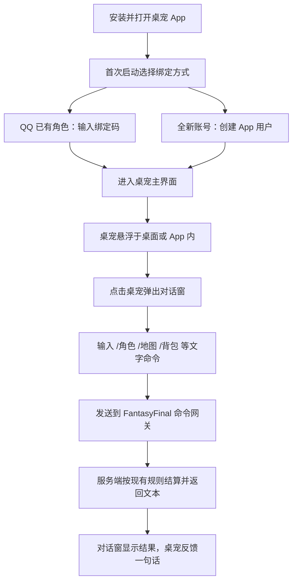

# 安卓桌宠 App 独立版设计方案 V1

> 目标：把 FantasyFinal 从 QQ 机器人扩展到独立的安卓桌宠 App，玩家安装后随时游玩，不再依赖 QQ 平台。  
> 初版范围：先完成“桌宠可交互图案 + 点击弹文本框 + 文本框发送现有文字命令”的最小闭环，后续再逐期接入完整界面。

## 1. 产品定位与初版形态

### 1.1 定位

App 内出现一只常驻的小桌宠（初版采用本项目的机巧/梨子喵风格美术或简单的 Q 版图形），它既是入口也是向导。桌宠显示角色状态、旅途提示和待办，点击后弹出对话框；玩家输入命令后，App 把命令转发给 FantasyFinal 游戏服务端，服务端复用现有全部玩法。

初版不复制整套 QQ 富文本界面，只做一个可随时打开的文字游戏终端：

| 形态 | 初版（V0.1） | 后续版本 |
| --- | --- | --- |
| 桌宠 | 半透明可拖拽悬浮球/小人，若干静态待机、点击、说话状态 | 动画、作息、天气、好感、语音 |
| 交互 | 点击桌宠弹出输入框与快捷命令 | 面板、标签页、卡片式操作 |
| 内容 | 直接调用现有 `/角色`、`/地图`、`/背包`、`/攻击` 等命令 | 原生按钮、地图可视化、战斗演出 |
| 账号 | 与现有 QQ 玩家库同一份数据 | 独立注册、跨端绑定 |

### 1.2 关键决策

1. **不新建游戏服务端**。游戏规则、数据库、事务、成就、经济全部继续使用 FantasyFinal 现有 AlemonJS 服务；App 只是新的客户端入口。
2. **初版交互以文本框为唯一主要输入**。桌宠图案只承担“可点、可说话、有状态”的引导，保证第一版能在数天内做出可安装的 APK。
3. **QQ 数据无缝复用**。现有 `players.qq_user_id` 是账号主键；App 端采用“首次启动绑定码”把手机账号与 QQ 角色绑定，或直接发放独立的 `app_` 前缀用户号并共用 `characters`。二者都保留同一份世界数据。
4. **服务端先开放受控 HTTP 命令网关**，再做 Android 客户端；命令网关复用现有 handler，而不是在 App 里复制一套规则。

## 2. 初版用户流程



### 2.1 首次启动

1. 展示“欢迎回到猫拉瑞亚”说明页，桌宠站在角色旁。
2. 未绑定用户提供两个入口：
   - **绑定 QQ 角色**：输入服务端下发的 6 位一次性绑定码（需要先在 QQ 机器人执行 `/App绑定`，服务端生成并关联玩家）。
   - **新建独立账号**：使用昵称注册，服务端创建 `app_*` 用户并进入现有注册流程。
3. 绑定成功后保存 `access_token`，默认自动登录。

### 2.2 日常使用

- 桌宠可以悬浮在 Android 桌面上（使用系统悬浮窗权限，可拖动、可缩放、可收起）。
- 点击桌宠弹出一个底部对话面板：顶部显示角色名、等级、位置；中部是聊天记录；底部是文本输入框与“发送”。
- 输入不带 `/` 的日常问候时，桌宠用固定语录回应；输入 `/xxx` 或游戏命令时，转发到服务端并展示完整结果。
- 收到战斗、行程、邮件等异步结果时，服务端通过推送（或轮询）送达，桌宠气泡显示通知。

## 3. 技术架构

### 3.1 总体结构

```text
Android 桌宠 App（Kotlin + Jetpack Compose）
    │ HTTPS（WebSocket 长连接 + REST JSON）
    ▼
FantasyFinal 服务端（现有 AlemonJS 进程）
    ├─ App 命令网关 /api/app/*     新增 Koa 子路由
    ├─ App 会话与绑定表             新增 MySQL 表
    ├─ 现有 game/service           直接复用，不复制规则
    └─ QQ 适配器（保留运行）
```

服务端新增能力全部放在当前 Koa 路由体系内，与现有管理后台 `registerAdminWebRoutes` 并列；不修改 QQ 命令入口的既有行为。

### 3.2 服务端技术选型

| 范畴 | 选择 | 原因 |
| --- | --- | --- |
| 接入框架 | 现有 Koa + `koa-router` | 已在 `src/index.ts` 中注册，改动最小 |
| 命令执行 | 复用现有 handler / service | 保证规则、数值、事务一致 |
| 传输 | HTTPS REST + WebSocket | 普通查询走 REST，战斗/行程等异步结果走 WS 推送 |
| 账号 | `app_users` + `player_bindings` | 不破坏现有 `players.qq_user_id` 唯一约束 |
| 认证 | 短期 `access_token` + 刷新令牌 | 与后台会话体系分离，App 可长期免密 |
| 美术 | 初版用静态位图/序列帧 | 机巧图片已有审核管线，后续可复用 |
| 构建 | Android Gradle + Kotlin + Compose | 社区成熟、桌面悬浮窗支持完善 |

### 3.3 Android 技术选型

| 模块 | 初版方案 |
| --- | --- |
| 语言 | Kotlin |
| UI | Jetpack Compose |
| 悬浮窗 | `WindowManager.TYPE_APPLICATION_OVERLAY`，服务中管理 |
| 网络 | Retrofit + OkHttp + WebSocket（推送） |
| 本地存储 | DataStore（token、设置）+ Room（离线消息） |
| 通知 | NotificationManager（战斗结果、邮件、行程到达） |
| 权限 | 悬浮窗、通知、网络；不申请后台定位 |
| 最低版本 | Android 8.0（API 26） |

### 3.4 初版目录

```text
android-app/
  app/
    src/main/java/com/fantasyfinal/pet/
      MainActivity.kt            # App 主界面，悬浮窗开关
      pet/PetView.kt             # 桌宠图形与点击/说话状态
      pet/PetOverlayService.kt   # 桌面悬浮窗服务
      chat/ChatSheet.kt          # 底部对话面板
      chat/CommandSender.kt      # 命令发送与结果解析
      net/ApiClient.kt           # Retrofit + WebSocket
      net/AppSession.kt          # token 与绑定状态
      data/BindingStore.kt       # DataStore 持久化
    src/main/res/                # 图标、桌宠位图、文案
  build.gradle.kts
  settings.gradle.kts
```

服务端新增目录沿用现有分层：

```text
src/
  app-api/
    router.ts                    # /api/app/* 路由
    session.service.ts           # 登录、绑定码、token
    command-gateway.service.ts   # 把命令路由到现有 response handler
    push.service.ts              # WebSocket/推送待发送结果
```

## 4. 服务端命令网关设计

### 4.1 为什么要网关

现有玩法全部由 AlemonJS 的 `router.group().use(...)` 和 handler 处理，handler 依赖 `useEvent()` 获得 `event.current.UserId`。网关要做的是：

1. 接收 App 的 JSON 请求，其中携带 `appUserId` 与命令文本。
2. 把 `appUserId` 解析成绑定角色对应的 `qq_user_id`。
3. 构造一个最小事件对象，使现有 handler 能正常运行。
4. 把 handler 产生的消息格式序列化为 App 可展示的文本/JSON。

这样 `/角色`、`/地图`、`/背包`、`/攻击`、`/技能 1`、`/移动 幽暗密林` 等现有命令全部可以原样使用。

### 4.2 命令网关接口

```http
POST /api/app/v1/command
Authorization: Bearer <access_token>
Content-Type: application/json

{
  "command": "/角色",
  "sessionId": "chat-session-01"
}
```

成功响应：

```json
{
  "ok": true,
  "message": {
    "text": "昵称：……\n等级：Lv1……",
    "buttons": [
      { "label": "详情", "command": "/角色详情" },
      { "label": "地图", "command": "/地图" }
    ],
    "toast": "桌宠想陪你到处看看。"
  },
  "serverTime": "2026-09-19T12:00:00+08:00"
}
```

### 4.3 异步推送

战斗、自动战斗、行程到达、邮件、成就公告等结果不是单次请求的响应。服务端先登记推送目标（WebSocket 会话），在现有定时结算或事件钩子里把结果推给 App：

```json
{
  "type": "travel.arrived",
  "title": "行程到达",
  "text": "你抵达了百纳镇……",
  "buttons": [{ "label": "查看地图", "command": "/地图" }]
}
```

### 4.4 安全与限流

- 所有 `/api/app/*` 只接受 HTTPS；无 HTTPS 时仅允许局域网联调。
- `access_token` 使用随机 32+ 字节，服务端哈希存储，过期时间初版 30 天。
- 绑定码 10 分钟有效、单次使用、与 QQ 角色一一对应；绑定成功后立刻作废。
- 命令网关按用户、按接口限流，登录接口单独限流；防刷与现有后台策略共用。
- 所有写入操作继续走 `withTransaction`，App 端不直接写库。

## 5. 账号与数据模型

### 5.1 设计规则

- `players.qq_user_id` 继续作为唯一身份键，不改为可空。
- App 用户是独立身份表，通过绑定表关联到 `players`；未绑定的 App 用户直接创建自己的玩家。
- 同一 `players` 行可以被一个 App 账号绑定，QQ 端与 App 端操作同一角色。
- 绑定是显式、可撤销、有审计的；撤销绑定不删除角色。

### 5.2 新增表

```sql
CREATE TABLE IF NOT EXISTS app_users (
  id BIGINT UNSIGNED NOT NULL AUTO_INCREMENT,
  app_user_id VARCHAR(64) NOT NULL,
  display_name VARCHAR(32) NOT NULL,
  status ENUM('active','disabled') NOT NULL DEFAULT 'active',
  created_at DATETIME NOT NULL DEFAULT CURRENT_TIMESTAMP,
  updated_at DATETIME NOT NULL DEFAULT CURRENT_TIMESTAMP ON UPDATE CURRENT_TIMESTAMP,
  PRIMARY KEY (id),
  UNIQUE KEY uk_app_users_app_id (app_user_id)
) ENGINE=InnoDB;

CREATE TABLE IF NOT EXISTS app_sessions (
  id BIGINT UNSIGNED NOT NULL AUTO_INCREMENT,
  app_user_id VARCHAR(64) NOT NULL,
  token_hash CHAR(64) NOT NULL,
  expires_at DATETIME NOT NULL,
  created_at DATETIME NOT NULL DEFAULT CURRENT_TIMESTAMP,
  PRIMARY KEY (id),
  UNIQUE KEY uk_app_sessions_token (token_hash),
  KEY idx_app_sessions_user (app_user_id, expires_at)
) ENGINE=InnoDB;

CREATE TABLE IF NOT EXISTS app_binding_codes (
  id BIGINT UNSIGNED NOT NULL AUTO_INCREMENT,
  qq_user_id VARCHAR(32) NOT NULL,
  code CHAR(6) NOT NULL,
  expires_at DATETIME NOT NULL,
  used_by_app_user VARCHAR(64) NULL,
  used_at DATETIME NULL,
  PRIMARY KEY (id),
  UNIQUE KEY uk_binding_codes_code (code),
  KEY idx_binding_codes_user (qq_user_id)
) ENGINE=InnoDB;

CREATE TABLE IF NOT EXISTS player_app_bindings (
  player_id BIGINT UNSIGNED NOT NULL,
  app_user_id VARCHAR(64) NOT NULL,
  bound_at DATETIME NOT NULL DEFAULT CURRENT_TIMESTAMP,
  PRIMARY KEY (player_id),
  UNIQUE KEY uk_player_app_binding_app (app_user_id),
  CONSTRAINT fk_app_binding_player FOREIGN KEY (player_id) REFERENCES players(id) ON DELETE CASCADE
) ENGINE=InnoDB;
```

表定义将追加到 `src/database/bootstrap.ts` 的 `schemaStatements`，与现有启动初始化保持一致，不在 App 端建表。

### 5.3 绑定流程

```text
QQ 端执行 /App绑定
    → 服务端生成 6 位码，10 分钟有效
App 输入绑定码
    → 校验玩家存在、绑定码未使用
    → 创建/复用 app_users，写入 player_app_bindings
    → 返回 access_token
```

未绑定 App 用户注册时：

```text
App 输入昵称 → 创建 app_users(app_xxx)
    → 沿用现有 beginRegistration / 注册继续 流程
    → 创建同一个 characters 角色
```

## 6. Android 桌宠初版界面

### 6.1 主界面

初版 App 打开后默认是全屏桌宠场景：

```text
┌──────────────────────────┐
│   猫拉瑞亚   Lv.12 剑士  │ ← 顶部小状态条
│                          │
│        (桌宠图案)        │ ← 居中，可拖动
│     “今天想去哪里？”    │ ← 气泡
│                          │
│  [角色] [地图] [背包]    │ ← 三个快捷按钮
│        [说点什么…]       │ ← 点击桌宠也弹出
└──────────────────────────┘
```

点击桌宠或输入条时弹出底部对话面板。初版不做一个完整浏览器式的游戏页，只做“记录式对话窗”。

### 6.2 桌宠状态

初版桌宠只有有限状态，全部由本地随机或命令结果触发：

| 状态 | 触发 | 表现 |
| --- | --- | --- |
| 待机 | 默认 | 轻微上下浮动，静态帧循环 |
| 点击 | 用户点击 | 放大一下，弹出输入框 |
| 说话 | 发送命令/收到结果 | 气泡显示一句反馈 |
| 休息 | 长时间未操作 | 变暗或坐下，点击唤醒 |
| 离线 | 网络断开 | 显示“联系不上旅店” |

### 6.3 对话面板

- 高度约为屏幕 55%，可上下拖动关闭。
- 消息按“玩家 / 桌宠 / 系统”分三色气泡。
- 支持发送纯文本命令；快捷词条可补全 `/` 前缀。
- 历史记录本地保存，支持复制、清空。
- 命令结果中的按钮在初版显示为可点击的文本命令，点击即发送，不发送到 QQ。

## 7. 初版实现清单与里程碑

### 7.1 里程碑

| 阶段 | 内容 | 产出 |
| --- | --- | --- |
| M1 服务端网关 | `app_users`、绑定码、`/api/app/v1/command`、最小 handler 桥接 | 可用 Postman/curl 玩 `/角色` `/地图` `/背包` |
| M2 Android 骨架 | Gradle 工程、MainActivity、Compose 基础页面、悬浮窗服务 | 可安装 APK，桌宠出现在桌面上 |
| M3 对话闭环 | 点击桌宠弹输入框，绑定 token，命令发送，文本结果展示 | 端到端可玩 |
| M4 状态与推送 | 桌宠待机/点击/说话状态、WebSocket 异步结果、系统通知 | 战斗/行程/邮件可推送 |
| M5 打磨 | 图标、启动页、离线提示、错误重试、命令快捷词 | 可交付给真实玩家内测 |

### 7.2 初版严格边界

初版明确不做：

- 不重写战斗、地图、商店、经济等游戏规则。
- 不做原生技能图标、战斗动画、地图瓦片或物品立绘。
- 不做 iOS 版（先验证 Android 桌宠形态）。
- 不做 QQ 消息桥接（App 与 QQ 共用数据，但消息互不转发）。
- 不引入游戏专用后端框架、容器或独立部署。
- 桌面悬浮窗只保留“可点、可拖、可收起”，不做复杂桌面小组件。

## 8. 后续版本演进

### 8.1 V0.2：可交互桌宠

- 桌宠增加多表情、天气与昼夜状态。
- 机巧形象上传/审核结果同步到 App 桌宠外观。
- 快捷面板改为九宫格：角色、地图、背包、技能、任务、邮件、商店、队伍、设置。
- 支持长按桌宠快速输入，支持语音输入转命令。

### 8.2 V0.3：轻量原生体验

- 地图页用简单列表/拓扑图展示区域与入口。
- 战斗页提供 4 个技能按钮和自动战斗开关。
- 物品、装备、任务用卡片列表，按钮直接提交服务端。
- 成就、奇遇、问心等流程改为分步页面。

### 8.3 V0.4：完整桌宠世界

- 桌宠有自己的好感、语录与随机事件。
- 家园可进入，桌宠在房间里走动。
- 离线托管、每日提醒、世界事件推送。
- iOS 版与 PC 悬浮版。

## 9. 验收标准

### 9.1 服务端验收

- `npx tsc --noEmit` 通过。
- 现有 QQ 命令不受影响；`/角色`、`/地图` 等 handler 不因网关改造而改变行为。
- 绑定码唯一、过期、单次使用；重复使用立即失败。
- App token 过期后自动刷新或重新登录，不出现明文密码存储。
- 同一角色在 QQ 与 App 双端操作时，数据库行锁与事务行为与现状一致。

### 9.2 Android 验收

- 最低 Android 8.0 可安装并运行。
- 桌宠可拖动、可点击弹窗、可收起；悬浮窗权限被拒时有引导。
- 断网时输入命令给出明确提示，恢复后自动重连。
- 命令结果里的按钮点击后发送正确命令，不回显为 QQ 链接。
- 异步推送（行程到达、战斗结果）在 App 前台显示气泡，在后台显示通知。

## 10. 风险与对策

| 风险 | 影响 | 对策 |
| --- | --- | --- |
| 现有 handler 依赖 QQ 事件上下文 | 网关无法直接调用 | 抽出“以 userId 执行命令”的适配层，构造最小事件；不改 handler 签名 |
| QQ 身份与 App 身份双账号 | 玩家数据分裂 | 绑定码优先，新账号复用同一 `characters`；绑定表唯一约束防重复 |
| 悬浮窗在国内 ROM 上权限严格 | 桌宠不可见 | 提供 App 内模式兜底，悬浮窗失败时主界面同样可玩 |
| 长命令输入体验差 | 初版可用性下降 | 提供快捷词条、历史记录、常用命令补全 |
| 命令结果含 QQ 专用格式 | App 显示异常 | 网关统一转成纯文本/按钮 JSON；初版明确不支持 Markdown 富文本 |
| HTTPS 证书与公网部署 | App 无法连接 | 复用后台公网部署方案，反代统一 HTTPS；开发期允许本地局域网 |

## 11. 结论

初版安卓桌宠 App 应当是一个“轻壳、重服务”的客户端：服务端新增命令网关与绑定体系，Android 端先做出可拖拽、可点击、可弹窗的桌宠形象与文字对话窗，把 FantasyFinal 的全部现有玩法完整接入，再用后续版本逐步把文字界面升级为原生交互。该路线改动集中、风险低，且能让玩家先获得一个真正独立于 QQ 的随时游玩入口。
